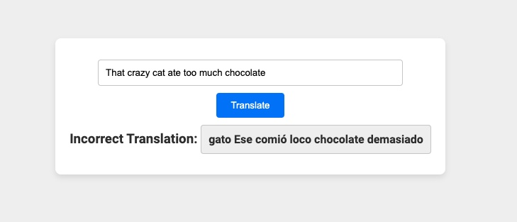

# "Mistranslatio" - Incorrect Spanish Translator

## Description

"Mistranslatio" is a fun and educational React and Node.js application that translates English text to Spanish, but with a twist. Instead of providing accurate translations, it intentionally returns incorrect translations by applying custom logic. This project is perfect for learning purposes, demonstrating API integration, frontend-backend communication, and basic error handling.



## Features

- **React Frontend**: Simple and user-friendly interface to input text and display incorrect translations.
- **Node.js and Express Backend**: Handles API requests and applies custom translation logic.
- **API Integration**: Utilizes the MyMemory Translation API to fetch translations.
- **Custom Translation Logic**: Modifies the correct translations to intentionally be incorrect.
- **Project Cleanup**: Streamlined project structure by removing unnecessary files.

## Project Link

Check out the live application here: [Mistranslatio on Heroku](https://mistranslatio-5f22cacf77e2.herokuapp.com/)

## Usage

1. **Clone the Repository**:

   ```sh
   git clone https://github.com/yourusername/mistranslatio.git
   cd mistranslatio
   ```

2. **Install Dependencies**:

   ```sh
   npm install
   cd client
   npm install
   ```

3. **Run the Application**:

   - Start the backend server:
     ```sh
     node server.js
     ```
   - Start the frontend development server:
     ```sh
     npm start
     ```

4. **Interact with the App**: Open your browser and navigate to `http://localhost:3000` to start using "Mistranslatio".

## Edge Cases

- If you type in just one word, no mistranslations happen.
- Special characters or numbers may not be handled correctly.
- Very short sentences might not get shuffled enough to notice a significant change.

## Future Improvements

- Enhance the custom translation logic to handle single words and short sentences better.
- Add more advanced mistranslation techniques.
- Improve the UI/UX for better user interaction.
- Implement additional languages for translation.
- Optimize performance and error handling.

## Contributing

Feel free to submit issues or pull requests. Contributions are welcome!
